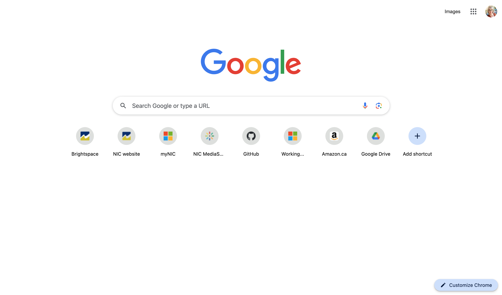

# Extra Assignment

## Objectives

You will recreate the desktop version of the Google homepage using as much flexbox as possible. Give yourself plenty of time, this assignment looks deceptively simple.

## Instructions

### 1. Get Set up

In Github, click on the green Code button > Select Download ZIP. Find the ZIP file in your Downloads folder and move it to an appropriate location on your computer. Unzip the file. Open the unzipped folder in VSCode.

### 2. Code the HTML
Code the HTML for this page. It is made up of anchors, images, buttons, and a form. The page doesn't include a header, main and footer.
   
   
Assets:
  - You can use the image called round.png in this repo's images folder for all round images.
  - You can use FontAwesome for all icons such as the magnifying glass, microphone and camera in the form's input field, the Google Apps icon in the top right corner, and the pencil icon in the button in th lower right hand corner (they don't need to match perfectly): https://fontawesome.com/v4/icons/. Make sure to link to the 4.7 stylesheet in the head element:     
  ```
  <link rel="stylesheet" href="https://cdnjs.cloudflare.com/ajax/libs/font-awesome/4.7.0/css/font-awesome.min.css"> 
  ```

### 3. Style the page
  - Use flexbox to create all the vertical and horizontal alignments. (For example, don't use positioning to move the content at the top to the top right corner of the screen.)
 - Resize your browser window to see how the content behaves on different screen sizes. You don't need to include any media queries 
- You will need to use positioning to place the icons inside the form input.

### Emil your files to your instructor once you've completed the assignment.

